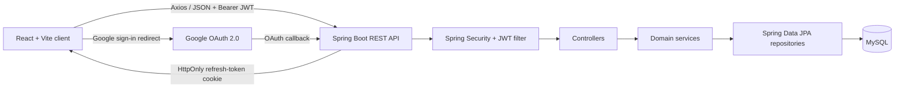
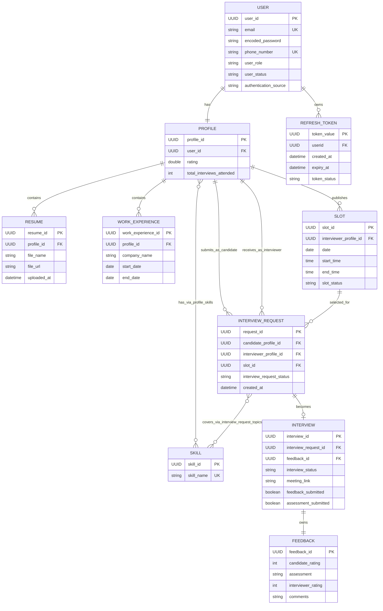

# Interview Coach

**Live Demo:** [https://interview-coach-ux.netlify.app](https://interview-coach-ux.netlify.app)


### Demo Credentials

| Role | Email | Password |
|------|-------|----------|
| Candidate | candidate@example.com | Demo@123 |
| Interviewer | interviewer@example.com | Demo@123 |


## Overview

Interview Coach is a full-stack mock-interview scheduling platform. It connects candidates with interviewers by matching interviewer profiles to requested skills, exposing interviewer availability, and managing the interview lifecycle from request to feedback.

The application addresses the coordination overhead of arranging structured practice interviews. Candidates can discover suitable interviewers and request open slots; interviewers can manage availability, respond to requests, host scheduled sessions through a meeting link, and assess candidates. Both participants maintain profiles with skills and professional experience.

Key capabilities include role-aware authentication, Google OAuth 2.0 sign-in, skill-based interviewer search, slot scheduling, interview request management, PDF resume records, and two-sided post-interview feedback.

## Features

### Backend

- Creates a user profile automatically when a user registers.
- Stores skills, work experience, resume metadata, availability slots, interview requests, interviews, feedback, and refresh tokens in MySQL through JPA.
- Searches interviewer profiles by one or more normalized skills and orders results by rating.
- Enforces interview request rules: candidates cannot request their own slots, unavailable slots cannot be requested, and a candidate cannot create a duplicate request for the same slot.
- Creates a scheduled interview with a meeting link after an interviewer accepts a pending request and books the selected slot.
- Supports completion and cancellation flows; a completed interview can receive feedback from both participants.
- Accepts PDF resume uploads and currently records a temporary `/uploads/<filename>` URL rather than uploading to an external object store.
- Exposes OpenAPI metadata through Springdoc.

### Frontend

- Provides React routes for registration, password login, Google sign-in, profile management, interviewer search, interviewer detail, slots, requests, and personal interviews.
- Uses role-protected routes for candidate, interviewer, and admin areas.
- Lets users manage profile skills and work experiences.
- Lets candidates search by skills, inspect an interviewer profile and available slots, and create or cancel interview requests.
- Lets interviewers create and delete availability slots, accept or reject requests, complete interviews, and submit assessments.
- Uses Axios interceptors to attach access tokens and retry one unauthorized request after refreshing an access token.

### Security

- Protects non-`/auth/**` backend routes with Spring Security and stateless bearer-token authentication.
- Uses short-lived JWT access tokens, persisted refresh-token sessions, and BCrypt password hashing.
- Supports Google OAuth 2.0 login and a post-login role-selection flow for first-time Google users.
- Applies method-level role checks to candidate and interviewer operations.
- Requires a user's `UserStatus` to be `VERIFIED` before JWT-authenticated protected requests can establish a security context.

### Candidate capabilities

- Register or sign in with local credentials or Google.
- Maintain a profile, skills, work experience, and resume records.
- Search interviewers by skills, view their profile and active slots, and request an interview.
- View and cancel pending requests, view personal interviews, cancel scheduled interviews, and submit feedback after completion.

### Interviewer capabilities

- Maintain a profile, skills, work experience, and resume records.
- Create and remove availability slots.
- View incoming interview requests, accept them with a meeting link, or reject them.
- View personal interviews, mark scheduled interviews complete, cancel scheduled interviews, and assess candidates after completion.

### Admin capabilities

`ADMIN` is a recognized role and the client contains protected placeholder routes for user and verification screens. No implemented admin controller, verification endpoint, or admin management UI exists in this repository yet.

## Tech Stack

| Area | Technologies and implementation |
| --- | --- |
| Backend | Java 21, Spring Boot 4.0.6, Spring MVC, Spring Data JPA, Spring Validation |
| Frontend | React 19, React Router 7, Vite 8, Tailwind CSS 4, React Icons |
| Database | MySQL through `mysql-connector-j`; Hibernate schema updates are enabled with `spring.jpa.hibernate.ddl-auto=update` |
| Authentication | Local email/password login, Google OAuth 2.0 client, JWT access tokens, refresh-token cookies |
| Authorization | Spring Security, `@EnableMethodSecurity`, `@PreAuthorize`, JWT role claim, client-side route guards |
| Password security | `BCryptPasswordEncoder` |
| API client | Axios with request and refresh-retry interceptors; `jwt-decode` for client token inspection |
| API documentation | Springdoc OpenAPI UI dependency and a bearer-auth security scheme |
| Build tools | Maven Wrapper for the server; npm and Vite for the client |
| Deployment references | Netlify frontend origin and a Railway backend OAuth URL are referenced in source; no deployment manifest is committed |
| DevOps | No Dockerfile, Docker Compose file, CI workflow, or infrastructure-as-code configuration is present |
| Caching | No cache provider or Spring caching configuration is implemented |

## System Architecture

### Overall architecture

The repository is a client/server monorepo. The React single-page application calls a stateless Spring Boot REST API. The API applies authentication and authorization, delegates business rules to service classes, and persists the domain model through Spring Data JPA repositories to MySQL.



### Request flow

1. The client sends a request through the shared Axios instance using `VITE_API_URL` as its base URL.
2. If available, the client adds the access token from `localStorage` as `Authorization: Bearer <token>`.
3. `JwtAuthenticationFilter` validates the JWT, loads the user, checks that the user is verified, and places the email and `ROLE_<role>` authority in the Spring Security context.
4. Controllers obtain the authenticated email from the security context and call service-layer methods.
5. Services enforce workflow and ownership rules, map DTOs, and use JPA repositories to read or write MySQL data.
6. DTO responses return to the client. On one `401` response, Axios calls `/auth/refresh` with credentials, stores the replacement access token, and retries the original request.

### Authentication flow

**Local sign-in:** registration hashes the submitted password with BCrypt, persists a `User` and `Profile`, and returns registration status. Login verifies the password, creates a persisted refresh-token record, returns a one-hour JWT access token, and sets the refresh token in an HttpOnly cookie.

**Refresh:** `/auth/refresh` reads the cookie, verifies that the persisted refresh token is active and unexpired, and issues a new JWT. Refresh tokens expire after 30 days in the entity model; inactive tokens cannot be used. The service keeps at most three active token sessions per user by inactivating the oldest before a new login.

**Google OAuth:** Spring Security delegates to Google. On success, the application finds or creates a Google-sourced user. Users with the `PENDING` role are redirected to choose `CANDIDATE` or `INTERVIEWER`; other users receive a refresh cookie and are redirected to the client with an access token in the URL fragment.

### Component interactions

Interview management composes the profile, skill, and slot services: it discovers interviewer profiles through their skills, validates a selected slot, creates an `InterviewRequest`, books the slot when the interviewer accepts, and creates an `Interview` plus its `Feedback` aggregate. Profile management owns skills and work experience; resume management independently stores validated PDF metadata against the current user's profile.

## Database Schema

All persisted identifiers are application-generated UUIDs. The schema below reflects the JPA entity annotations in `server/project/src/main/java/com/interviewcoach/project/models`.



### Entity reference

| Entity | Primary key | Foreign keys / relationships | Purpose |
| --- | --- | --- | --- |
| `User` | `userId` | One-to-one `Profile`; one-to-many `RefreshToken` | Authenticated account, role, status, credentials, and authentication source. |
| `Profile` | `profileId` | `user_id` to `User`; one-to-many `Resume` and `WorkExperience`; many-to-many `Skill` | Shared candidate/interviewer profile with rating and interview count. |
| `Skill` | `skillId` | Many-to-many with `Profile` and `InterviewRequest` | Normalized reusable skill/topic vocabulary. |
| `Resume` | `resumeId` | `profile_id` to `Profile` | Resume filename, URL, and upload timestamp. |
| `WorkExperience` | `workExperienceId` | `profile_id` to `Profile` | Employment record for a profile. |
| `Slot` | `slotId` | `interviewer_profile_id` to `Profile`; embedded `SlotTiming` | An interviewer's dated availability window and booking status. |
| `InterviewRequest` | `requestId` | Candidate profile, interviewer profile, and slot; many-to-many `Skill` topics | A candidate's request for a specific interviewer slot. |
| `Interview` | `interviewId` | `interview_request_id` to `InterviewRequest`; `feedback_id` to `Feedback` | The scheduled/completed/cancelled outcome of an accepted request. |
| `Feedback` | `feedbackId` | Owned one-to-one by `Interview` | Both sides' post-interview rating and written feedback. |
| `RefreshToken` | `tokenValue` | `userid` to `User` | Server-side refresh-token session, expiry, and active/inactive state. |

### Embedded value objects

| Value object | Stored with | Fields |
| --- | --- | --- |
| `SlotTiming` | `Slot` | `date`, `startTime`, `endTime` |
| `CandidatesAssessment` | `Feedback` | `candidateRating`, `assessment` |
| `InterviewersFeedback` | `Feedback` | `interviewerRating`, `comments` |

### Relationships, cascades, and constraints

- `Profile` owns a one-to-one association to `User` through `user_id`. The annotation models a one-to-one relationship; no explicit `nullable = false` or `unique = true` is declared on the join column.
- `Profile` owns one-to-many `resumes` and `workExperiences`. Both use `cascade = ALL` and `orphanRemoval = true`; their child entities own the foreign key. `Resume.profile` is non-null and non-updatable, while `WorkExperience.profile` is non-null.
- `Profile` and `Skill` use the `profile_skills(profile_id, skill_id)` join table. `InterviewRequest` and `Skill` use `interview_request_topics(request_id, skill_id)`. Neither many-to-many association declares a cascade.
- `InterviewRequest` has many-to-one references to candidate profile, interviewer profile, and slot. These annotations do not declare cascade behavior or database-level non-nullability.
- `Interview` owns one-to-one links to `InterviewRequest` and `Feedback`. The feedback link uses `cascade = ALL`, `orphanRemoval = true`, and eager fetching; the request link is lazy and has no cascade.
- `RefreshToken` has a required `userid` foreign key to `User`; no cascade is declared.
- `User.email` is non-null, unique, and validated as an email. `phoneNumber` is unique when supplied and uses an Indian phone-number regex. `Skill.skillName` is non-null, unique, non-blank, and limited to 50 characters.
- Resume filenames and URLs are non-blank; URLs use `@URL`. Work experience requires a non-blank company name (maximum 50 characters) and a start date. Service validation rejects an end date before the start date.
- Slot dates and start/end times are `@NotNull`; slot service validation requires `startTime` to be before `endTime`.
- Ratings inside feedback value objects are constrained from 1 through 5. Enumerations are persisted as strings for roles, statuses, and authentication source.

## Project Structure

```text
.
├── client/
│   └── interview-coach-ui/
│       ├── public/                 # Static assets and Netlify redirect rule
│       ├── src/
│       │   ├── components/         # Route guards, layout, profile, slot, and interview UI
│       │   ├── layouts/            # Shared application layout
│       │   ├── pages/              # Auth, candidate, interviewer, and common user screens
│       │   ├── services/           # Axios configuration and API-facing service functions
│       │   ├── App.jsx             # Client route tree
│       │   └── main.jsx            # React entry point
│       ├── package.json            # npm scripts and frontend dependencies
│       └── vite.config.js          # Vite, React compiler, and Tailwind plugins
├── server/
│   └── project/
│       ├── src/main/java/com/interviewcoach/project/
│       │   ├── auth/               # Local/Google auth, DTOs, refresh-token service
│       │   ├── security/           # JWT service/filter and Spring Security configuration
│       │   ├── config/             # CORS, password encoder, OpenAPI configuration
│       │   ├── models/             # JPA entities and embeddables
│       │   ├── ProfileManagement/  # Profiles, skills, and work experience
│       │   ├── SlotManagement/     # Interviewer availability slots
│       │   ├── InterviewManagement/# Requests, interviews, and feedback
│       │   ├── ResumeManagement/   # PDF resume metadata operations
│       │   └── GlobalExceptionHandler.java
│       ├── src/main/resources/
│       │   └── application.properties # Environment-driven server configuration
│       ├── pom.xml                 # Maven dependencies and Java version
│       └── mvnw                    # Maven Wrapper
└── README.md
```

## Getting Started

### Prerequisites

- Java 21
- Node.js and npm
- A running MySQL instance
- A Google OAuth client if Google sign-in is required

### Installation

Clone the repository, then install the client dependencies and prepare the server environment:

```bash
git clone <repository-url>
cd interview-coach

cd client/interview-coach-ui
npm ci

cd ../../server/project
```

### Environment Variables

Create `server/project/.env` (or provide these variables through your shell or deployment platform). Spring Boot reads the following values from `application.properties` and the OAuth success handler:

| Variable | Required | Description |
| --- | --- | --- |
| `DB_URL` | Yes | JDBC connection URL for MySQL, for example `jdbc:mysql://localhost:3306/interview_coach` |
| `DB_USERNAME` | Yes | MySQL user name |
| `DB_PASSWORD` | Yes | MySQL password |
| `JWT_SECRET` | Yes | Base64-encoded HMAC signing key used by `JwtService` |
| `GOOGLE_CLIENT_ID` | For Google login | Google OAuth 2.0 client ID |
| `GOOGLE_CLIENT_SECRET` | For Google login | Google OAuth 2.0 client secret |
| `CLIENT_DOMAIN` | For Google login | Client origin used by the OAuth success redirect, for example `http://localhost:5173` |
| `PORT` | No | Server port; defaults to `8080` |

Create `client/interview-coach-ui/.env`:

```dotenv
VITE_API_URL=http://localhost:8080
```

For Google OAuth locally, configure the callback accepted by Spring Security in the Google Cloud console (normally `http://localhost:8080/login/oauth2/code/google`) and ensure `CLIENT_DOMAIN` matches the Vite origin.

### Running Locally

Start the server in one terminal:

```bash
cd server/project
./mvnw spring-boot:run
```

Start the client in another terminal:

```bash
cd client/interview-coach-ui
npm run dev
```

The Vite development server normally runs at `http://localhost:5173` and the API defaults to `http://localhost:8080`.

Useful verification commands:

```bash
cd server/project
./mvnw test

cd ../../client/interview-coach-ui
npm run lint
npm run build
```

### Running with Docker

Docker support is not currently included: the repository has no `Dockerfile` or Docker Compose configuration. Run the server, client, and MySQL locally or add container definitions as a future improvement.

## API Overview

All routes except `/auth/**` require a bearer access token. The controller code uses the authenticated email from the JWT security context for ownership checks.

### Authentication

| Method | Endpoint | Summary |
| --- | --- | --- |
| `POST` | `/auth/register` | Creates a local candidate or interviewer account and its profile. |
| `POST` | `/auth/login` | Authenticates a local account, returns an access token, and sets a refresh-token cookie. |
| `POST` | `/auth/refresh` | Issues a new access token from the refresh-token cookie. |
| `GET` | `/auth/logout` | Inactivates the current refresh token and clears the cookie. |
| `POST` | `/auth/role/setup` | Assigns `CANDIDATE` or `INTERVIEWER` to a Google-authenticated pending user. |
| `GET` | `/oauth2/authorization/google` | Spring Security OAuth entry point used by the client for Google sign-in. |

### Candidate

| Method | Endpoint | Summary |
| --- | --- | --- |
| `GET` | `/interviews/interviewers?skills=...&pageNumber=0&pageSize=10` | Candidate-only search for interviewer profiles matching one or more skills. |
| `POST` | `/interviews/requests` | Candidate-only creation of an interview request for an available slot. |
| `PUT` | `/interviews/requests/{id}/cancel` | Cancels the current candidate's pending request. |
| `PUT` | `/interviews/{id}/cancel` | Cancels a scheduled interview when the caller is either participant. |
| `POST` | `/interviews/{id}/feedback` | After completion, records the candidate's feedback for the interviewer. |

### Interviewer

| Method | Endpoint | Summary |
| --- | --- | --- |
| `POST` | `/slots/me` | Interviewer-only creation of one or more availability slots. |
| `GET` | `/slots/me` | Lists the current interviewer's slots. |
| `DELETE` | `/slots/{slotId}` | Interviewer-only deletion of an owned slot. |
| `GET` | `/interviews/requests/pending` | Lists the current interviewer's pending incoming requests. |
| `PUT` | `/interviews/requests/{id}/accept?meetingLink=...` | Interviewer-only acceptance; books the slot and creates a scheduled interview. |
| `PUT` | `/interviews/requests/{id}/reject` | Interviewer-only rejection of a pending request. |
| `PUT` | `/interviews/{id}/complete` | Interviewer-only completion of an owned interview. |
| `POST` | `/interviews/{id}/feedback` | After completion, records the interviewer's candidate assessment. |

### Admin

No admin API endpoints are implemented. The `ADMIN` role and protected client placeholders exist, but administrative user management and verification flows are not yet backed by controllers.

### Profile

| Method | Endpoint | Summary |
| --- | --- | --- |
| `GET` | `/profiles/me` | Returns the authenticated user's profile. |
| `GET` | `/profiles/interviewer?email=...` | Returns a profile by email; the client uses this for interviewer detail. |
| `POST` | `/profiles/me/skills` | Replaces the current profile's skills with normalized skill names. |
| `GET` | `/profiles/me/work-experiences` | Lists the current profile's work experience. |
| `GET` | `/profiles/work-experiences?email=...` | Lists work experience for a profile by email. |
| `POST` | `/profiles/me/work-experiences` | Adds a work-experience record to the current profile. |
| `DELETE` | `/profiles/me/work-experiences/{id}` | Deletes an owned work-experience record. |

### Interview

| Method | Endpoint | Summary |
| --- | --- | --- |
| `GET` | `/interviews/requests/me` | Lists requests for the current user, chosen by their candidate/interviewer role. |
| `GET` | `/interviews/requests/pending` | Lists current user's pending requests, chosen by role. |
| `GET` | `/interviews/me` | Lists the current candidate's or interviewer's interviews. |
| `PUT` | `/interviews/{id}/cancel` | Cancels a scheduled interview and marks the linked slot available in memory; see implementation notes in Future Improvements. |
| `POST` | `/interviews/{id}/feedback` | Stores the caller's feedback or assessment after interview completion. |

### Skills

There is no standalone skills controller. Skills are created or reused through `POST /profiles/me/skills` and while creating `POST /interviews/requests`; they are queried through the interviewer search endpoint.

### Slots

| Method | Endpoint | Summary |
| --- | --- | --- |
| `GET` | `/slots/get?email=...` | Returns available slots for the supplied interviewer's email. |
| `POST` | `/slots/me` | Creates availability slots for the authenticated interviewer. |
| `GET` | `/slots/me` | Lists all slots for the authenticated interviewer. |
| `DELETE` | `/slots/{slotId}` | Deletes an owned slot. |

### Resumes

| Method | Endpoint | Summary |
| --- | --- | --- |
| `POST` | `/resumes` | Uploads a PDF and stores its metadata against the current profile. |
| `GET` | `/resumes` | Lists the current profile's resume records. |
| `DELETE` | `/resumes/{resumeId}` | Deletes an owned resume record. |

### Health check

| Method | Endpoint | Summary |
| --- | --- | --- |
| `GET` | `/api/hello` | Returns a simple backend-live message. |

## Security

- **Spring Security:** CSRF is disabled and sessions are stateless. CORS currently permits `http://localhost:5173` and `https://interview-coach-ux.netlify.app`, with credentials enabled.
- **JWT authentication:** `JwtService` signs a JWT with a Base64-decoded secret. The token subject is the user's email, the `role` claim contains the role, and its configured lifetime is one hour.
- **OAuth2 login:** Google OAuth is enabled through `spring-boot-starter-oauth2-client` and uses a custom success handler to provision users, set a refresh cookie for established roles, and redirect to the client.
- **Role authorization:** Service methods protect candidate-only interviewer discovery/request creation and interviewer-only slot, request-decision, and completion actions. Route guards mirror those roles in the client but backend checks remain authoritative.
- **Refresh tokens:** Refresh tokens are UUIDs persisted with status, created time, expiry time, and associated user. Logout marks the token inactive; a maximum of three active sessions is maintained per user.
- **Password encryption:** Local passwords are persisted only as BCrypt hashes in `encodedPassword`; Google users are blocked from password login.
- **Validation and ownership:** JPA/Bean Validation protects selected fields, while services validate slot timing, work-experience dates, resource ownership, request state, and feedback eligibility.

## Design Decisions

- **A shared `Profile` for both roles:** Candidate and interviewer data use the same profile, skill, resume, and work-history model. Role is held on `User`, avoiding duplicated person data while allowing workflows to distinguish participants.
- **Reusable skills with join tables:** `Skill` is normalized and unique by name. The two many-to-many join tables let profiles advertise skills and requests capture interview topics without duplicating strings across records.
- **Interview request before interview:** A request records a candidate's intent, chosen slot, topics, and notes. Only accepted requests produce an `Interview`, preserving rejected and cancelled request history separately.
- **Embedded time and feedback values:** `SlotTiming`, `CandidatesAssessment`, and `InterviewersFeedback` have no identity outside their owner, so they are embedded rather than separate tables.
- **JWT plus persisted refresh sessions:** JWTs keep protected API calls stateless and fast, while persisted refresh tokens support expiry, logout revocation, and active-session limits.
- **DTO boundary:** Controllers exchange DTOs instead of exposing JPA entities directly, which limits API payloads and keeps persistence relationships from leaking into the client.
- **Validation and errors:** Bean Validation covers field formats, while services enforce workflow-specific constraints. `GlobalExceptionHandler` maps known application exceptions to a common `ApiError` response shape.
- **Security considerations:** Server-side authorization and ownership checks are applied to sensitive operations; the client stores the access token in `localStorage` and relies on an HttpOnly refresh cookie. Production deployments should use HTTPS and keep client origins and OAuth redirects aligned with CORS configuration.

## Screenshots

Add screenshots to `docs/screenshots/` and replace the placeholders below when visual assets are available.

| Screen | Placeholder |
| --- | --- |
| Login and Google sign-in | `docs/screenshots/login.png` |
| Candidate interviewer search | `docs/screenshots/interviewer-search.png` |
| Interviewer slot management | `docs/screenshots/slots.png` |
| Interview request workflow | `docs/screenshots/interview-requests.png` |
| Profile and work experience | `docs/screenshots/profile.png` |

## Future Improvements

- Implement the currently placeholder admin verification and user-management workflow, including verified-status changes that are required for protected requests.
- Add a dedicated admin API and corresponding UI rather than only protected route placeholders.
- Replace the temporary resume URL with durable object storage, file-size limits, malware scanning, and authorized download access.
- Add database constraints for relationship optionality/uniqueness where intended, and enforce one accepted interview per request/slot at the database level.
- Add pagination controls to the interviewer-search UI, which currently calls the backend without page parameters.
- Add automated unit, integration, and end-to-end tests beyond the generated Spring Boot context-load test.
- Add Docker, Compose, CI, environment templates, and deployment configuration for repeatable delivery.
- Add a feedback retrieval endpoint; a service stub exists but its controller mapping is commented out and the method returns `null`.
- Avoid placing an access token in the OAuth redirect URL fragment if a different secure exchange design is preferred.


## License

No license file is included in this repository. Add a license before redistributing or accepting contributions under defined terms.
